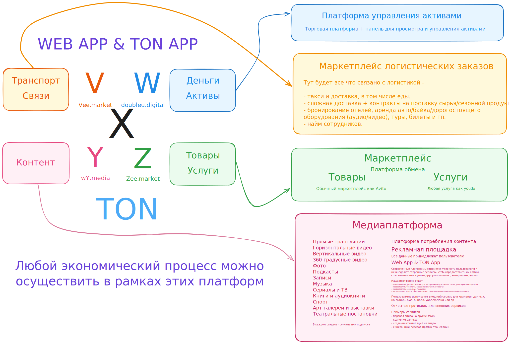

# 🚀 Roadmap 2025-2026

## 💥 Квантовый скачок в экономике: от потребителей к совладельцам

> **Представьте мир, где каждая покупка делает вас совладельцем бизнеса.** Где водитель Uber владеет долей в платформе. Где создатель контента на YouTube получает не 55%, а 99% доходов. Где покупатель в магазине становится акционером с каждой покупкой.

### 🧬 Новая экономическая ДНК

**Старая модель умирает:**
- Корпорации забирают 20-45% комиссии
- Пользователи = источник дохода
- Прибыль уходит акционерам с Уолл-стрит
- Монополии контролируют рынки

**Наша модель — квантовый скачок:**
- Комиссии 1-5% (в 10 раз меньше!)
- Пользователи = совладельцы через токены
- Прибыль распределяется между участниками
- Децентрализованные экосистемы

### 🌊 Эффект цунами

Когда люди поймут, что могут:
- Получать долю в бизнесе с каждой покупкой
- Зарабатывать на росте платформ, которыми пользуются
- Платить в 10 раз меньше комиссий

**Они просто перестанут использовать традиционные сервисы.** Это не конкуренция — это вымирание старой модели. Amazon, Uber, YouTube не смогут снизить комиссии до 1% — их акционеры не позволят. А мы можем, потому что наши акционеры — это наши пользователи.

### 📈 Математика революции

Простой пример из реальной жизни:
- Обычное кафе: вы платите, владелец богатеет
- Наше кафе: вы платите и получаете токены-акции
- Через год при росте бизнеса ваши токены стоят x10
- **Вы заработали на том, что просто ели!**

Масштабируйте это на все сферы жизни. Это не эволюция — это революция.

### ⚖️ Конец монополии на результаты труда

**Сейчас:**
- Вы работаете → корпорация получает прибыль → неизвестные фонды с Уолл-стрит богатеют
- Водитель Uber зарабатывает $20/час → Uber зарабатывает $10/час с каждого водителя → акционеры получают миллиарды
- Создатель контента генерирует $1000 → YouTube забирает $450 → алгоритмы решают, кого продвигать

**В новой модели:**
- Вы работаете → вы получаете токены-акции → вы владеете результатами своего труда
- Водитель получает 95% + токены платформы → через год его токены стоят больше, чем весь заработок
- Создатель получает 99% + становится совладельцем → его успех = рост стоимости его доли

**Это фундаментальный сдвиг:** впервые в истории технологии позволяют каждому владеть средствами производства и результатами своего труда. Не через революцию, а через математику и код.

---

> 🔥 **10 прорывных проектов**, которые запустят эту революцию! Каждый проект — это не просто бизнес, а новая экономическая модель, где пользователи становятся совладельцами.
> 
> ⚡ **Секретное оружие**: разработка через ИИ (Claude Code) позволяет создавать MVP за недели, а не месяцы. Пока корпорации думают, мы уже запускаем!
> 
> 💎 **Философия**: Мы не конкурируем. Мы создаем новую реальность, где старые модели просто перестают работать.

## Проект 1: Smart News Aggregator

### 🎯 Проблема
> Существующие новостные каналы перегружены негативом, мемами и однотипным контентом. Люди тратят часы на просмотр информационного шума вместо действительно важных новостей

### 💡 Решение
> ИИ-агрегатор, который автоматически парсит Telegram и YouTube каналы, фильтруя только действительно важные и позитивные новости без мусора

### 🚀 Ключевые преимущества
- Персонализированная лента без негатива и мемов
- Экономия 80% времени на чтение новостей
- Умная категоризация по интересам пользователя

### 📊 Потенциал
> Рынок новостных агрегаторов растёт на 15% в год. При 100+ млн активных пользователей Telegram, даже 1% проникновения = 1 млн пользователей. Проект будет разрабатываться публично через Claude Code на стримах как демонстрация возможностей ИИ-разработки, что создаст дополнительный маркетинговый эффект и быструю монетизацию через медиаплощадки

### 🔗 Репозиторий
> [GitHub](https://github.com/chatman-media/news-aggergator)

---

## Проект 2: 🌍 Global Truth Network

### 🎯 Проблема
> Мировые СМИ превратились в машину манипуляций: 90% контента — это мнения, эмоции и скрытая реклама. Люди не могут отличить факты от пропаганды, тонут в информационном мусоре

### 💡 Решение
> ИИ-платформа, которая анализирует мировые новости из YouTube и Telegram, оставляя только проверенные факты без мнений, эмоций и манипулятивных техник

### 🚀 Ключевые преимущества
- 100% фактов без "воды" и манипуляций
- Мультиязычный анализ источников со всего мира
- ИИ-верификация через перекрестные источники

### 📊 Потенциал
> В эпоху фейков и информационных войн, доверие к медиа упало до 29%. Платформа чистых фактов — это новая ниша с потенциалом охвата 500+ млн думающих людей по всему миру

### 🔗 Репозиторий
> [GitHub]()

---

## Проект 3: 🎭 Equilibrium - Фазовые портреты

### 🎯 Проблема
> 99% людей не знают, как выглядит их настоящее симметричное лицо. Асимметрия лица напрямую связана с психологическим состоянием, но инструментов для самоанализа через визуальную симметрию не существует

### 💡 Решение
> TON Mini App для создания фазовых портретов — зеркальных отражений половин лица. Простой слайдер позволяет увидеть себя с левой или правой симметрией, открывая путь к самопознанию

### 🚀 Ключевые преимущества
- Психокоррекция через визуальное самонаблюдение
- NFT-маркетплейс для монетизации уникальных портретов
- Премиум за 1 TON открывает шеринг и продажу NFT

### 📊 Потенциал
> Рынок селфи-приложений — $1.2 млрд. Интеграция с психологией и NFT создает новую нишу. При 500 млн пользователей Telegram даже 0.1% конверсии в премиум = 500K TON

### 🔗 Репозиторий
> [GitHub](https://github.com/chatman-media/equilibrium)

---

## Проект 4: 🎬 Timeline Studio - ИИ-видеоредактор

### 🎯 Проблема
> Контент-мейкеры тратят 80% времени на адаптацию одного видео под разные соцсети. Нужно вручную обрезать под TikTok, переформатировать для YouTube Shorts, добавлять эффекты для Instagram — это убивает креативность

### 💡 Решение
> ИИ-видеоредактор, который из одного исходника автоматически создает десятки версий для всех платформ: вертикальные для TikTok, горизонтальные для YouTube, Stories для Instagram — всё с трендовыми эффектами

### 🚀 Ключевые преимущества
- Экономия 10x времени на адаптацию контента
- ИИ знает тренды каждой платформы и применяет их
- Локальная обработка — ваш контент остается приватным

### 📊 Потенциал
> Рынок видеоредакторов — $8.5 млрд к 2027. При 2+ млрд создателей контента, захват 1% рынка = 20 млн пользователей × $50/год = 💰 **$1 МЛРД выручки!** Готовность проекта уже 77.5%!

### 🔗 Репозиторий
> [GitHub](https://github.com/chatman-media/timeline-studio)

---

## Проект 5: 📺 Y Media - Справедливая медиаплатформа

### 🎯 Проблема
> YouTube и TikTok манипулируют алгоритмами, продвигая эмоциональный мусор вместо ценного контента. Создатели получают копейки, а платформы забирают 45-55% доходов. Модерация подавляет неугодные мнения

### 💡 Решение
> Децентрализованная медиаплатформа на токенах YDM, где ИИ ранжирует контент по реальной ценности, а не кликбейту. Создатели получают 99% доходов от рекламы, становятся совладельцами платформы

### 🚀 Ключевые преимущества
- Революционная комиссия 1% против 45% у YouTube
- Справедливое ранжирование ценного контента без манипуляций
- Создатели = совладельцы через токены YDM

### 📊 Потенциал
> Рынок видеоплатформ — $240 млрд. YouTube забирает 45% доходов создателей, мы берем 1%. При захвате 1% рынка = 💰 **$500+ МЛН выручки в год!** (1% от рекламы + премиум-подписки + NFT-маркетплейс + аналитика)

### 🔗 Репозиторий
> [GitHub](https://github.com/chatman-media/y)

---

## Проект 6: 🛍️ Z Marketplace - Экосистема товаров и услуг

### 🎯 Проблема
> Amazon и Ozon забирают 15-30% комиссии, контролируют продавцов, блокируют аккаунты без объяснений. Продавцы не имеют доли в платформах, которые строят своим трудом. Нет интеграции с контентом и логистикой

### 💡 Решение
> Децентрализованный маркетплейс на токенах ZDM с минимальными комиссиями. Продавцы и покупатели становятся совладельцами. Глубокая интеграция с Y Media (реклама), V Logistics (доставка) и W Assets (токенизация бизнеса)

### 🚀 Ключевые преимущества
- Комиссия 2-3% против 15-30% у гигантов
- Продавцы = совладельцы через токены ZDM
- Единая экосистема: контент → товар → доставка → инвестиции

### 📊 Потенциал
> Рынок e-commerce — $6.3 трлн. Amazon берет в среднем 20% комиссии. При захвате 1% рынка и комиссии 3% = 💰 **$1.9 МЛРД выручки в год!**

### 🔗 Репозиторий
> [GitHub](https://github.com/chatman-media/z)

---

## Проект 7: 💎 W Assets - Децентрализованная торговая платформа

### 🎯 Проблема
> Robinhood и брокеры манипулируют рынком, блокируют торговлю в критические моменты. Трейдеры платят огромные комиссии, не имея доли в платформах. 90% трейдеров теряют деньги из-за отсутствия доступа к профессиональным стратегиям

### 💡 Решение
> Торговая платформа на токенах WDM, где топ-трейдеры и управляющие делятся стратегиями и получают вознаграждение. Поддержка всех активов: крипта, акции, ETF, токенизированная недвижимость. DeFi-интеграция без посредников

### 🚀 Ключевые преимущества
- Копирование сделок топ-трейдеров в один клик
- Токенизация любых активов (недвижимость, искусство)
- Трейдеры = совладельцы через токены WDM

### 📊 Потенциал
> Рынок онлайн-трейдинга — $8.5 трлн. Комиссии брокеров — $100+ млрд в год. При захвате 1% рынка = 💰 **$1 МЛРД выручки в год!** Первая платформа с реальным совладением

### 🔗 Репозиторий
> [GitHub](https://github.com/chatman-media/w)

---

## Проект 8: 🚚 V Logistics - Универсальный маркетплейс перемещений

### 🎯 Проблема
> Uber и логистические гиганты забирают 25-40% комиссии. Водители не имеют доли в платформах. Нет единой экосистемы для всех видов перемещений: от доставки дроном до международных грузоперевозок

### 💡 Решение
> Децентрализованная платформа на токенах VDM для любых перемещений: такси, грузоперевозки, дроны, аренда транспорта, склады. ИИ оптимизирует маршруты, водители и курьеры становятся совладельцами

### 🚀 Ключевые преимущества
- Комиссия 5% против 25-40% у Uber/DHL
- Мультимодальные перевозки (грузовик + дрон + склад)
- Исполнители = совладельцы через токены VDM

### 📊 Потенциал
> Рынок логистики — $10.4 трлн. Uber/DHL берут в среднем 30% комиссии. При захвате 1% рынка и комиссии 5% = 💰 **$5.2 МЛРД выручки в год!**

### 🔗 Репозиторий
> [GitHub](https://github.com/chatman-media/vee-market)

---

## Проект 9: 🌐 X Digital - Единая экосистема всего

### 🎯 Проблема
> Пользователи вынуждены регистрироваться в десятках разных сервисов. Нет единой экосистемы, где контент, товары, финансы и логистика работают вместе. Корпорации монополизируют отдельные ниши, не давая пользователям стать совладельцами

### 💡 Решение
> X Digital объединяет Y Media, Z Marketplace, W Assets и V Logistics в единую децентрализованную экосистему. Один аккаунт, единая токеномика XDM, полная интеграция всех сервисов. Пользователи = совладельцы всей экосистемы

### 🚀 Ключевые преимущества
- Синергия 4 платформ: контент → продажи → инвестиции → доставка
- Единый токен XDM для всей экосистемы
- Первая в мире полностью децентрализованная экосистема

### 📊 Потенциал
> Суммарный рынок 4 платформ — $25+ трлн. При захвате 1% каждого сегмента = 💰 **$10+ МЛРД совокупной выручки в год!** Это новый Amazon, но где пользователи — хозяева

### 🔗 Репозиторий
> [GitHub](https://github.com/chatman-media/x-digital)

---

## Проект 10: 🏪 AK Brand - Сеть нового поколения

### 🎯 Проблема
> Традиционные розничные сети теряют клиентов из-за высоких наценок (50-200%), устаревшего сервиса и отсутствия персонализации. Покупатели не получают никакой доли от прибыли магазинов, которые посещают годами

### 💡 Решение
> Инновационная торговая сеть AK с собственной продукцией и партнерскими товарами. Интеграция с экосистемой X Digital, кэшбэк в токенах, покупатели становятся совладельцами. ИИ-персонализация и минимальные наценки

### 🚀 Ключевые преимущества
- Наценка 10-20% против 50-200% у традиционных сетей
- Покупатели = совладельцы через токены AK
- Омниканальность: офлайн магазины + онлайн через Z Marketplace

### 📊 Потенциал
> Рынок розничной торговли — $27 трлн. При открытии 1000 точек и среднем обороте $1 млн/год = 💰 **$1 МЛРД выручки в год!** Первая сеть, где покупатели — совладельцы

### 🔗 Репозиторий
> [GitHub](https://github.com/chatman-media/ak-brand)